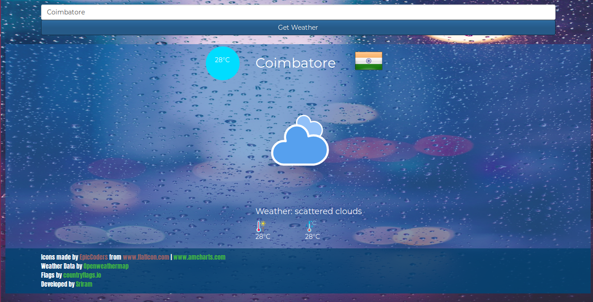
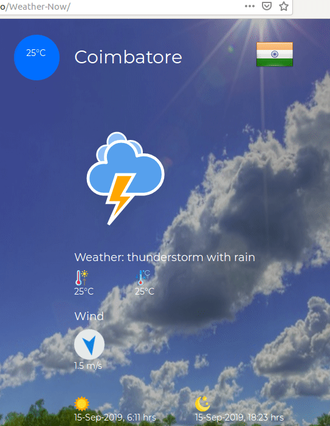

# Weather Now #

A simple JS weather application, where you can get weather data of a particular city or loacality by searching its name in the Search box.

Credits:

 - Icons:
 	- EpicCoders from [www.flaticon.com](https://www.flaticon.com)
 	- [www.amcharts.com](www.amcharts.com)
 - Weather Data:
 	- [Open Weather Map](https://openweathermap.org)
 - Flags:
 	- [countryflags.io](https://countryflags.io)
 - Developed by:
 	- [Sriram Balasubramanian](https://twitter.com/imsriramb)

# Try it!!
## [sriram23.github.io/Weather-Now](https://sriram23.github.io/Weather-Now) 
